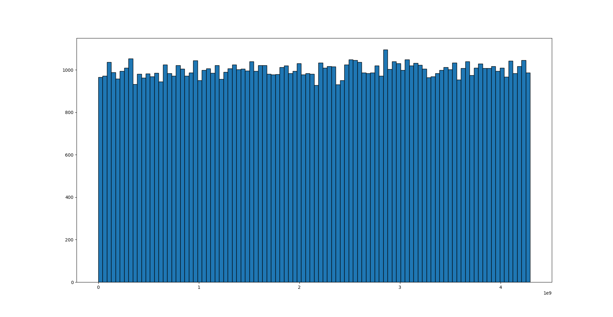

# HMAC RNG

Simple pseudo-random number generator based on keyed-hash MAC function (SHA-256). RNG is able to generate variable-length unsigned integers ranging from 1 to 16 bytes.

Created for educational purposes only, not safe for cryptographic use.

## RNG testing

Run [statistical tests](statistical_tests.py) for tests based on NIST SP 800-22 Rev. 1a (requires [nistrng](https://github.com/InsaneMonster/NistRng) package).

RNG passes around half the tests, making it unsuitable for real-world use (at least for cryptographic purposes).

## Sample histogram

Run [histogram](histogram.py) for histogram plot. Generated numbers approximately follow uniform distribution.

```
N = 100000
bin_count = 100
```



## Sources

* [NIST SP 800-22 Rev. 1a.](https://csrc.nist.gov/publications/detail/sp/800-22/rev-1a/final)
* [Handbook of Applied Cryptography, chapter 5](https://cacr.uwaterloo.ca/hac/about/chap5.pdf)